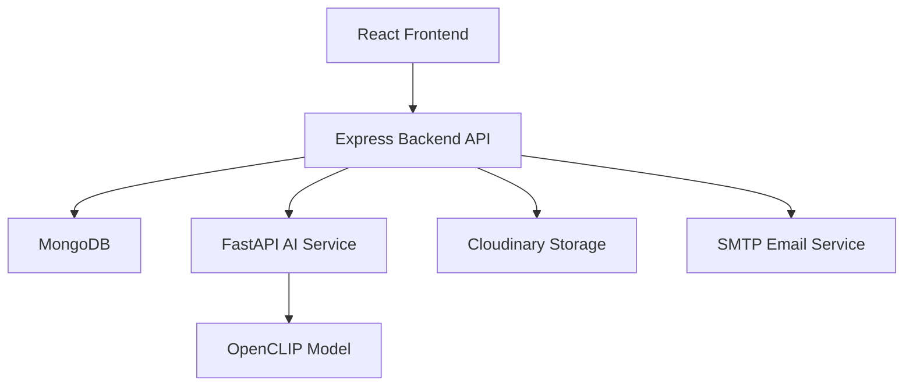

# Campus Lost & Found AI

A production-ready, AI-powered Lost & Found Management System for college campuses. Uses OpenCLIP image embeddings and multi-factor matching to reunite students with their lost belongings.

## Problem Statement

College campuses lose thousands of items every year. Traditional lost & found systems rely on manual browsing and keyword search, making recovery slow and inefficient. This platform uses AI-powered image similarity and metadata matching to automatically connect lost items with their found counterparts.

## Architecture



## AI Workflow

1. User reports a lost/found item with an image
2. Backend sends image to AI Service for embedding generation (OpenCLIP ViT-B/32)
3. Embedding is stored alongside item metadata
4. Match engine compares embeddings + metadata (brand, color, category, location, date)
5. Weighted scoring produces ranked matches with explainability
6. Student reviews matches and submits ownership claim
7. Admin verifies and approves/rejects claim
8. QR recovery receipt is generated upon approval

## Technology Stack

| Layer | Technology |
|-------|-----------|
| Frontend | React 18, TypeScript, Vite, Tailwind CSS, TanStack Query |
| Backend | Node.js, Express, TypeScript, Mongoose, Zod |
| AI Service | Python, FastAPI, OpenCLIP, PyTorch |
| Database | MongoDB |
| Storage | Cloudinary |
| Auth | JWT (httpOnly cookies), bcrypt |
| Testing | Jest, Supertest, Vitest, React Testing Library, pytest |
| Deployment | Docker, Vercel, Render, Railway |

## Folder Structure

```
├── client/                 # React frontend (Vite)
│   ├── src/
│   │   ├── components/     # Reusable UI components
│   │   ├── contexts/       # Auth & Theme providers
│   │   ├── lib/            # API client, services, utils
│   │   ├── pages/          # Route pages (lazy loaded)
│   │   ├── tests/          # Vitest component tests
│   │   └── types/          # TypeScript interfaces
│   ├── Dockerfile
│   ├── nginx.conf
│   └── vercel.json
├── server/                 # Express backend
│   ├── src/
│   │   ├── config/         # Env, DB, Swagger, Mailer
│   │   ├── constants/      # App-wide constants
│   │   ├── controllers/    # Request handlers
│   │   ├── middlewares/    # Auth, validation, rate limit
│   │   ├── models/         # Mongoose schemas
│   │   ├── repositories/   # Data access layer
│   │   ├── routes/         # API route definitions
│   │   ├── services/       # Business logic
│   │   ├── tests/          # Jest + Supertest tests
│   │   ├── utils/          # Helpers (logger, QR, upload)
│   │   └── validators/     # Zod schemas
│   ├── Dockerfile
│   └── render.yaml
├── ai-service/             # FastAPI AI microservice
│   ├── app/
│   │   ├── api/            # Route handlers
│   │   ├── models/         # CLIP model manager
│   │   ├── services/       # Embedding & preprocessing
│   │   └── utils/          # Logger
│   ├── tests/              # pytest tests
│   ├── Dockerfile
│   └── railway.toml
└── docker-compose.yml      # Full-stack orchestration
```

## API Documentation

Interactive Swagger UI available at `/api/docs` when the backend is running.

Key endpoints:
- `POST /api/auth/register` — Register user
- `POST /api/auth/login` — Login (sets httpOnly cookies)
- `GET /api/lost-items` — List lost items (paginated)
- `POST /api/lost-items` — Report lost item
- `GET /api/lost-items/:id/matches` — AI match results
- `POST /api/claims` — Submit ownership claim
- `PATCH /api/claims/:id/review` — Admin approve/reject
- `GET /api/claims/:id/recovery-receipt` — QR receipt
- `GET /api/admin/analytics` — Dashboard analytics
- `GET /api/health` — Health check (MongoDB + AI status)

## Installation Guide

### Prerequisites
- Node.js 20+
- Python 3.11+
- MongoDB 7+
- npm 10+

### Local Development

```bash
# 1. Clone and install backend
cd server
cp .env.example .env  # Configure environment
npm install
npm run dev

# 2. Install and start AI service
cd ../ai-service
python -m venv venv && source venv/bin/activate
pip install -r requirements.txt
uvicorn app.main:app --reload --port 8000

# 3. Install and start frontend
cd ../client
npm install
npm run dev
```

## Docker Setup

```bash
# Start all services (MongoDB + Backend + AI + Frontend)
docker compose up --build

# Access:
# Frontend:  http://localhost:3000
# Backend:   http://localhost:5000
# AI Service: http://localhost:8000
# Swagger:   http://localhost:5000/api/docs
```

## Environment Variables

### Backend (server/.env)
| Variable | Description | Default |
|----------|-------------|---------|
| MONGODB_URI | MongoDB connection string | (required) |
| JWT_ACCESS_SECRET | Access token secret | (required) |
| JWT_REFRESH_SECRET | Refresh token secret | (required) |
| CLIENT_URL | Frontend origin for CORS | http://localhost:5173 |
| AI_SERVICE_URL | AI microservice URL | http://localhost:8000 |
| CLOUDINARY_CLOUD_NAME | Cloudinary cloud | (optional) |
| SMTP_HOST | Email server host | (optional) |
| SMTP_USER | Email server user | (optional) |
| SMTP_PASS | Email server password | (optional) |

## Deployment Guide

### Frontend → Vercel
1. Connect GitHub repo to Vercel
2. Set root directory to `client/`
3. Framework preset: Vite
4. Build command: `npm run build`
5. Output directory: `dist`

### Backend → Render
1. Create new Web Service from repo
2. Root directory: `server/`
3. Build: `npm install && npm run build`
4. Start: `npm start`
5. Add environment variables from dashboard

### AI Service → Railway
1. Create new service from repo
2. Root directory: `ai-service/`
3. Builder: Dockerfile
4. Add `PORT` environment variable

### Database → MongoDB Atlas
1. Create free cluster
2. Add connection string to backend `MONGODB_URI`
3. Whitelist backend IP / allow all for development

## Testing

```bash
# Backend tests
cd server && npx jest

# Frontend tests
cd client && npx vitest run

# AI Service tests
cd ai-service && pip install -r requirements-dev.txt && pytest
```

## Future Scope

- Real-time notifications via WebSocket
- Mobile app (React Native)
- Multi-language support
- Advanced analytics dashboard with charts
- Bulk item import via CSV
- SMS notifications via Twilio
- Item expiry and auto-archive
- Student feedback and rating system
